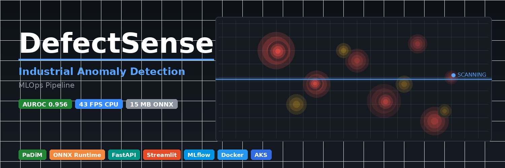

# DefectSense — Industrial Anomaly Detection MLOps Pipeline

[](https://www.python.org/)
[](https://pytorch.org/)
[](https://onnxruntime.ai/)
[](https://fastapi.tiangolo.com/)
[](https://www.docker.com/)
[](LICENSE)

A complete end-to-end MLOps system for real-time industrial defect detection. DefectSense trains a PaDiM model on normal images only, exports it to an optimized ONNX runtime, and serves it through a FastAPI backend with a Streamlit dashboard — deployable locally, via Docker Compose, or on Kubernetes (AKS).

---

## Key Performance Numbers

| Metric | Value |
|---|---|
| Image AUROC (MVTec, avg 15 classes) | 0.850 |
| Pixel AUROC (MVTec, avg 15 classes) | 0.956 |
| CPU throughput (Intel Core i9) | 43 FPS |
| GPU throughput (NVIDIA A100) | 547 FPS |
| ONNX model size | 15 MB |
| Training images required | Normal images only — no defect labels |

---

## Architecture Overview

```
┌─────────────────────────────────────────────────────────┐
│  Data (MVTec AD format)                                  │
│  dataset/<class>/train/good/   ← normal images only      │
└─────────────────┬───────────────────────────────────────┘
                  │
┌─────────────────▼───────────────────────────────────────┐
│  src/train.py  (training pipeline)                       │
│  ├── DefectSense.Padim.fit()  — frozen ResNet features   │
│  ├── MLflow tracking (experiments, metrics, artifacts)   │
│  ├── ONNX export via ModelExporter                       │
│  └── Drift baseline generation → outputs/baseline.csv   │
└─────────────────┬───────────────────────────────────────┘
                  │  distributions/padim_model.onnx
┌─────────────────▼───────────────────────────────────────┐
│  FastAPI backend (src/fastapi_app_np.py  ← production)   │
│  src/fastapi_app.py  ← PyTorch + ONNX fallback variant  │
│  Port 8080 │ ONNX Runtime (CPU or CUDA)                  │
│  POST /predict  POST /predict-batch  GET /health         │
└─────────────────┬───────────────────────────────────────┘
                  │  HTTP
┌─────────────────▼───────────────────────────────────────┐
│  Streamlit dashboard  (src/streamlit_app_v2.py)          │
│  Port 8501 │ 6 tabs: Analysis, Batch, History,           │
│            │         Model Info, Benchmark, Registry     │
└─────────────────────────────────────────────────────────┘

  Supporting layers
  ├── src/ai/optimizer.py   — ONNX Runtime benchmark + optimization
  ├── src/ai/registry.py    — model version / stage management (JSON)
  ├── src/ai/compare.py     — side-by-side model comparison
  ├── src/monitor_drift.py  — production drift detection (alibi-detect)
  ├── monitoring/           — App Insights, drift alerts, Prometheus
  ├── docker/               — multi-stage Dockerfiles
  ├── k8s/                  — Kubernetes manifests (AKS)
  ├── deployment/           — Azure ML endpoint configs
  ├── devops/               — Azure DevOps YAML pipelines
  └── jobs/                 — Azure ML job definitions
```

---

## Repository Structure

```
industrial-anomaly-detection/
├── azure_components/          # Python scripts to provision Azure resources
│   ├── resource_group_create.py
│   ├── storage_account_create.py
│   └── work_space_create.py
├── data/                      # Dataset root (MVTec AD layout expected)
├── deployment/                # Azure ML online endpoint configs
│   ├── deployment.yml
│   ├── endpoint-k8s-config.yml
│   └── score.py
├── devops/                    # Azure DevOps pipeline YAML
│   └── azure-pipelines.yml
├── distributions/             # ONNX + PyTorch model artifacts + model_info.json
├── doc/                       # Visual assets (banners)
├── docker/                    # Dockerfiles
│   ├── Dockerfile             # Generic
│   ├── Dockerfile.np          # Production ONNX-only (no PyTorch)
│   ├── Dockerfile.streamlit   # Streamlit frontend
│   ├── Dockerfile.train       # Training image
│   └── Dockerfile.inference   # Inference image
├── environment/               # Conda env definitions
├── integration/               # End-to-end integration tests
├── jobs/                      # Azure ML job definitions
├── k8s/                       # Kubernetes manifests
│   ├── deployment.yml
│   ├── service.yml
│   └── deployment_services_gpu.yml
├── keyvault/                  # Azure Key Vault setup scripts
├── load_testing/
│   └── locustfile.py          # Locust load tests against FastAPI
├── models/                    # Stored model files (.onnx, .pth)
├── monitoring/                # Drift detection, App Insights, Prometheus
│   ├── app_insights_setup.py
│   └── drift_alert_setup.py
├── outputs/                   # Pipeline outputs (e.g. baseline_reference.csv)
├── pipelines/                 # Azure DevOps YAML (infra + CI/CD templates)
├── requirements/
│   ├── requirements.txt       # Full stack (PyTorch + ONNX)
│   └── requirements_np.txt    # Production (ONNX-only, no PyTorch)
├── src/
│   ├── DefectSense/           # Core library (installable package)
│   │   ├── defectsense/       # PaDiM, training, detection, evaluation, export
│   │   │   ├── padim.py
│   │   │   ├── train.py
│   │   │   ├── detect.py
│   │   │   ├── eval.py
│   │   │   ├── export.py
│   │   │   ├── cli.py         # `defectsense` CLI entry point
│   │   │   ├── feature_extraction.py
│   │   │   ├── mahalanobis.py
│   │   │   └── visualization/
│   │   ├── config.yml         # Reference configuration file
│   │   └── pyproject.toml     # Library package manifest (hatchling, uv)
│   ├── ai/
│   │   ├── optimizer.py       # ONNX benchmark + optimization
│   │   ├── registry.py        # Model version + stage registry
│   │   └── compare.py         # Model comparison reports
│   ├── static/                # Shared anodet utilities (torch-free variant)
│   ├── fastapi_app_np.py      # Production FastAPI — ONNX-only (port 8080)
│   ├── fastapi_app.py         # Dev FastAPI — ONNX + PyTorch fallback
│   ├── streamlit_app_v2.py    # Dashboard v2 (6 tabs)
│   ├── streamlit_app.py       # Dashboard v1 (legacy)
│   ├── train.py               # Top-level training script with MLflow
│   ├── monitor_drift.py       # Production drift monitoring
│   └── data_validation.py     # Dataset validation script
├── tests/
│   └── test_defectsense.py
├── docker-compose.yml
└── pyproject.toml             # Project manifest (Poetry)
```

---

## Prerequisites

- Python 3.11
- Docker and Docker Compose (for containerized deployment)
- `kubectl` and an AKS cluster (for Kubernetes deployment)
- An Azure subscription (for Azure ML, ACR, Key Vault — optional)

---

## Quick Start

### 1. Clone the repository

```bash
git clone https://github.com/rayenx2/DefectSense
cd DefectSense
```

### 2. Install dependencies

Two requirements files are provided depending on your use case:

**Full stack (training + inference, requires PyTorch):**

```bash
pip install -r requirements/requirements.txt
```

**Production inference only (ONNX Runtime, no PyTorch — smaller footprint):**

```bash
pip install -r requirements/requirements_np.txt
```

### 3. Install the DefectSense library

The `src/DefectSense/` directory is a standalone installable package. Install it using `uv` (recommended) or pip:

```bash
# With uv — CPU
pip install uv
cd src/DefectSense
uv venv --python 3.11 .venv
source .venv/bin/activate
uv sync --extra cpu

# With uv — CUDA 12.1
uv sync --extra cu121

# With pip — CPU
pip install -e "src/DefectSense[cpu]"
```

---

## Training

### Dataset format

DefectSense uses the [MVTec AD](https://www.mvtec.com/company/research/datasets/mvtec-ad) directory layout. Custom datasets work with the same structure — only normal images are needed at training time:

```
dataset/
└── <class_name>/
    ├── train/
    │   └── good/          # Normal training images only
    └── test/
        ├── good/          # Normal test images
        └── <defect_type>/ # Anomalous test images (for evaluation)
```

### Train with the top-level script (MLflow tracking)

```bash
python src/train.py \
  --dataset_path ./data/bottle \
  --backbone resnet18 \
  --feat_dim 50 \
  --batch_size 2 \
  --model_data_path ./distributions \
  --onnx_output_name padim_model.onnx \
  --mlflow_tracking_uri file:./mlruns \
  --mlflow_experiment_name padim_anomaly_detection \
  --evaluate_model
```

**Key training arguments:**

| Argument | Default | Description |
|---|---|---|
| `--dataset_path` | required | Path to `<class>/` folder containing `train/good/` |
| `--backbone` | `resnet18` | Feature extractor: `resnet18` or `wide_resnet50` |
| `--feat_dim` | `10` | Random feature dimensions to retain |
| `--layer_indices` | `[0]` | Backbone layer indices to extract from |
| `--batch_size` | `2` | Training and inference batch size |
| `--model_data_path` | `./distributions/` | Output directory for ONNX and PyTorch artifacts |
| `--output_model` | `model_padim.pt` | PyTorch model filename |
| `--onnx_output_name` | `padim_model.onnx` | ONNX export filename |
| `--threshold` | `13.0` | Anomaly classification threshold |
| `--evaluate_model` | flag | Run evaluation after training |
| `--generate_baseline` | `true` | Generate drift baseline CSV |
| `--mlflow_tracking_uri` | `file:./mlruns` | MLflow tracking URI |
| `--config` | `config.yml` | Path to YAML config (CLI args override) |

The training pipeline runs five steps: train, ONNX export, optional evaluation, drift baseline generation, and metadata saving. All parameters and metrics are logged to MLflow.

### Train via the DefectSense CLI

After installing the `src/DefectSense` package, the `defectsense` CLI is available:

```bash
defectsense train --config src/DefectSense/config.yml --dataset_path ./data/bottle

defectsense export --model model.pt --format onnx --quantize-dynamic

defectsense detect --model model.onnx --img_path ./test_images --thresh 13.0

defectsense eval --config src/DefectSense/config.yml --enable_visualization
```

### Reference configuration file

`src/DefectSense/config.yml` documents every option. Key sections:

```yaml
dataset_path:    ./data
class_name:      bottle
resize:          [224, 224]
crop_size:       ~
normalize:       true
norm_mean:       [0.485, 0.456, 0.406]
norm_std:        [0.229, 0.224, 0.225]

backbone:        resnet18
feat_dim:        50
layer_indices:   [0]
batch_size:      2
thresh:          13.0

format:          all       # onnx | torchscript | openvino | all
dynamic_batch:   true
```

---

## Running Locally (without Docker)

### Start the FastAPI backend

**Production variant (ONNX-only, `requirements_np.txt`):**

```bash
MODEL_PATH=./models/padim_model.onnx \
  python -m uvicorn src.fastapi_app_np:app --host 0.0.0.0 --port 8080
```

**Full variant (ONNX with PyTorch fallback):**

```bash
python -m uvicorn src.fastapi_app:app --host 0.0.0.0 --port 8000
```

The server looks for a model in this order: `padim_model.onnx` (ONNX) then `distributions/padim_model.pt` (PyTorch). Set `MODEL_PATH` to override the ONNX path.

### Start the Streamlit dashboard

```bash
# Point the dashboard at the FastAPI backend
streamlit run src/streamlit_app_v2.py --server.port 8501 -- --host localhost --port 8080
```

Open [http://localhost:8501](http://localhost:8501).

---

## Docker Deployment

### Docker Compose (recommended for local + staging)

The `docker-compose.yml` at the project root starts both services:

```yaml
services:
  fastapi:
    build:
      dockerfile: docker/Dockerfile.np   # ONNX-only production image
    ports:
      - "8080:8080"
    environment:
      - MODEL_PATH=./models/padim_model.onnx
    volumes:
      - ./models:/app/models

  streamlit:
    build:
      dockerfile: docker/Dockerfile.streamlit
    ports:
      - "8501:8501"
    depends_on:
      - fastapi
```

```bash
# Build and start both services
docker compose up --build

# Or detached
docker compose up -d --build
```

The FastAPI service is available at `http://localhost:8080` and the dashboard at `http://localhost:8501`.

### Build individual images

```bash
# Production FastAPI (ONNX-only, ~slim base, non-root user)
docker build -f docker/Dockerfile.np -t fastapi-defectsense:latest .

# Streamlit frontend
docker build -f docker/Dockerfile.streamlit -t streamlit-defectsense:latest .

# Training image
docker build -f docker/Dockerfile.train -t defectsense-train:latest .
```

### Push to Azure Container Registry

```bash
docker tag fastapi-defectsense:latest acrdefectsense.azurecr.io/fastapi-defectsense:latest
az acr login --name acrdefectsense
docker push acrdefectsense.azurecr.io/fastapi-defectsense:latest
```

---

## Kubernetes Deployment (AKS)

Manifests are in the `k8s/` directory.

```bash
# Create the ACR pull secret
kubectl create secret docker-registry acr-secret \
  --docker-server=acrdefectsense.azurecr.io \
  --docker-username=<service-principal-id> \
  --docker-password=<service-principal-secret>

# Apply deployment and service
kubectl apply -f k8s/deployment.yml
kubectl apply -f k8s/service.yml

# Verify
kubectl get pods
kubectl get service defectsense-service
```

The `k8s/deployment.yml` deploys the `acrdefectsense.azurecr.io/fastapi-defectsense:latest` image as `defectsense-deploy`. The `k8s/service.yml` exposes port 80 → container port 8080 via a `LoadBalancer`.

A GPU-enabled deployment variant is available at `k8s/deployment_services_gpu.yml`.

### Azure ML online endpoint

```bash
az ml online-endpoint create --file deployment/endpoint-k8s-config.yml
az ml online-deployment create \
  --name my-deployment \
  --endpoint my-endpoint \
  --file deployment/deployment.yml
```

---

## API Reference Summary

Both FastAPI servers expose identical endpoints. The production server is `fastapi_app_np.py` running on port 8080. Full interactive docs at `http://localhost:8080/docs`.

| Method | Endpoint | Description |
|---|---|---|
| `GET` | `/` | Service info and endpoint listing |
| `GET` | `/health` | Health check: model status, model type, threshold |
| `POST` | `/predict` | Single-image anomaly inference (multipart upload) |
| `POST` | `/predict-batch` | Batch inference, up to 10 images |
| `GET` | `/model-info` | Loaded model inputs, outputs, threshold |
| `POST` | `/config` | Update threshold and resize dimensions |

See [docs/README.md](docs/README.md) for full request/response schemas.

### Quick curl examples

```bash
# Health check
curl http://localhost:8080/health

# Single image prediction
curl -X POST http://localhost:8080/predict \
  -F "file=@image.jpg" \
  -F "include_visualizations=true"

# Batch prediction (up to 10 images)
curl -X POST http://localhost:8080/predict-batch \
  -F "files=@img1.jpg" \
  -F "files=@img2.jpg"

# Update threshold
curl -X POST http://localhost:8080/config \
  -H "Content-Type: application/json" \
  -d '{"threshold": 20.0, "resize_width": 224, "resize_height": 224}'
```

---

## Testing

```bash
# Unit tests
pytest tests/

# Integration tests
pytest integration/

# Load testing (Locust — requires FastAPI running on port 8080)
locust -f load_testing/locustfile.py --host http://localhost:8080

# Data validation
python src/data_validation.py
```

---

## Monitoring and Drift Detection

```bash
# Register a production baseline after training
python src/register_baseline.py

# Monitor production data for drift
python src/monitor_drift.py
```

The training script (`src/train.py`) automatically generates a baseline reference CSV at `outputs/baseline_reference.csv` when `--generate_baseline` is set (default: true). This baseline is also uploaded to MLflow as an artifact.

Application logs are structured via `loguru` and optionally forwarded to Azure Application Insights (`monitoring/app_insights_setup.py`). Prometheus metrics are configured in `monitoring/`.

---

## CI/CD

The Azure DevOps pipeline is defined in `devops/azure-pipelines.yml` and covers:

- Model training and retraining
- Unit and integration tests
- Docker image build and push to ACR
- Automated deployment to AKS
- Cleanup and rollback

Reusable pipeline templates are in `pipelines/templates/`. Infrastructure provisioning pipelines are in `pipelines/infra/`.

---

## MLflow Experiment Tracking

Training runs log the following to MLflow:

- Parameters: backbone, batch size, layer indices, feat dim, input shape
- Metrics: training time, AUC score, PR-AUC, accuracy, anomaly score stats, baseline statistics
- Artifacts: ONNX model, PyTorch model, model_info.json, config.yml, baseline reference CSV

```bash
# Launch the MLflow UI
mlflow ui --backend-store-uri file:./mlruns --port 5000
```

Open [http://localhost:5000](http://localhost:5000).

---

## Model Registry

`src/ai/registry.py` provides a lightweight JSON-based model lifecycle manager integrated into the Streamlit dashboard:

```python
from ai.registry import ModelRegistry

reg = ModelRegistry("./models")
reg.register("padim_v2.onnx", {"backbone": "resnet18", "auroc": 0.95})
reg.promote("padim_v2.onnx", "production")
current = reg.get_current("production")
reg.rollback("production")   # revert to previous production model
```

Supported stages: `staging` → `production` → `archived`. Stage transitions and history are persisted in `models/model_registry.json`.

---

## Technologies

| Category | Technology |
|---|---|
| ML framework | PyTorch 2.2+, torchvision |
| Core algorithm | PaDiM (Patch Distribution Modeling) |
| Runtime | ONNX Runtime 1.18+ (CPU + CUDA execution providers) |
| Feature extractor | ResNet-18, Wide-ResNet-50 (frozen) |
| Inference API | FastAPI 0.111+, Uvicorn |
| Dashboard | Streamlit 1.46+ |
| Experiment tracking | MLflow 2.13+ |
| Drift detection | alibi-detect 0.12 |
| Containerization | Docker (multi-stage), Docker Compose |
| Orchestration | Kubernetes (AKS) |
| Cloud platform | Azure ML, Azure Container Registry, Azure Key Vault |
| CI/CD | Azure DevOps YAML pipelines |
| Monitoring | Azure Application Insights, Prometheus |
| Load testing | Locust |
| Image processing | OpenCV, Pillow, scikit-image |
| Scientific computing | NumPy, SciPy, scikit-learn |

---

## Performance Benchmarks

### MVTec AD — average over 15 classes

| Model | Image AUROC | Pixel AUROC | CPU FPS | GPU FPS | Model size |
|---|---|---|---|---|---|
| DefectSense (resnet18) | **0.850** | **0.956** | **43 FPS** | **547 FPS** | **15 MB** |
| Anomalib PaDiM (baseline) | 0.810 | 0.935 | 13 FPS | 356 FPS | 40 MB |

CPU: Intel Core i9. GPU: NVIDIA A100. Batch size 1. Reproduce with:

```bash
defectsense eval --config src/DefectSense/config.yml
```

### VisA — average over 12 classes

| Model | Image AUROC | Pixel AUROC | CPU FPS |
|---|---|---|---|
| DefectSense | 0.812 | 0.962 | 44.8 FPS |
| Anomalib PaDiM | 0.783 | 0.954 | 13.5 FPS |

---

## License

MIT — see [LICENSE](LICENSE).

---

Built by [Rayen Lassoued](https://github.com/rayenx2) — Junior AI/ML Engineer
